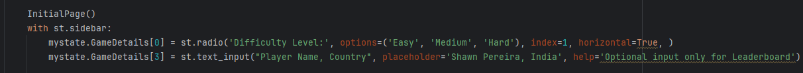
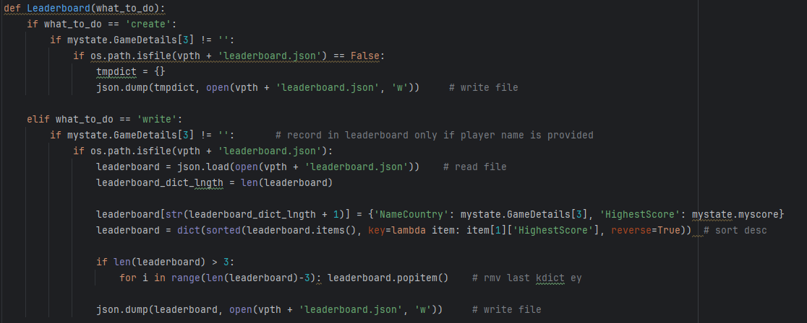
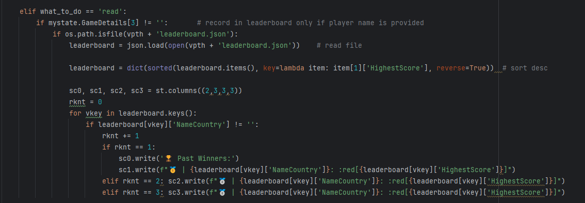
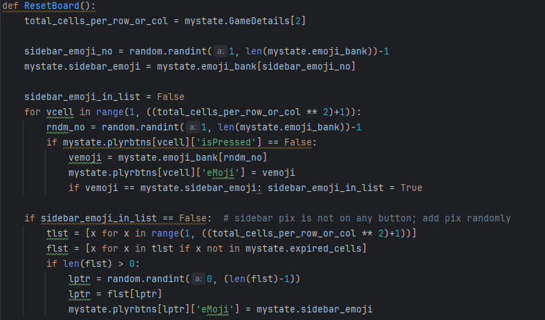
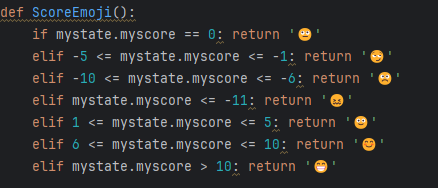

# Requistos vs código
## Requisitos Funcionales y Criterios de Aceptación

| Requisito y Criterios de Aceptación                                                                                                                                                                                                                                                                                                                                                                                                                                                                                                                                      | Código/Imagen                                                                           |
|--------------------------------------------------------------------------------------------------------------------------------------------------------------------------------------------------------------------------------------------------------------------------------------------------------------------------------------------------------------------------------------------------------------------------------------------------------------------------------------------------------------------------------------------------------------------------|-----------------------------------------------------------------------------------------|
| **1. Configuración de Nivel de Dificultad** **Requisito:** El sistema debe permitir a los jugadores seleccionar el nivel de dificultad antes de comenzar el juego. **Criterios de Aceptación:** - Opciones de dificultad fácil, medio y difícil disponibles para selección. - La configuración de dificultad debe influir en la mecánica del juego, como la frecuencia de regeneración de imágenes y la puntuación. - Tiempos de regeneración específicos:   - Fácil: cada 8 segundos.   - Medio: cada 6 segundos.   - Difícil: cada 5 segundos. |                                                                  |
| **2. Inicialización del Tablero** **Requisito:** Al comenzar un juego, el sistema debe inicializar el tablero con un conjunto aleatorio de imágenes basado en la dificultad seleccionada. **Criterios de Aceptación:** - El tablero debe ser llenado con imágenes de emojis que corresponden a la dificultad elegida. - Ninguna imagen objetivo (emoji de la barra lateral) debe aparecer más de una vez en el tablero inicial. - La imagen objetivo debe ser seleccionada aleatoriamente y mostrada en la barra lateral.                                 |                                   |
| **3. Parametrización del Nombre del Jugador y País** **Requisito:** El sistema debe permitir a los jugadores ingresar su nombre y país antes de comenzar el juego. **Criterios de Aceptación:** - Debe existir un campo de texto para que los jugadores ingresen su nombre y país. - Es posible que los campos de nombre y país estén vacíos, pero en ese caso no se muestra el _Leaderboard_ - La información del jugador debe persistir durante la sesión de juego.                                                                                     |                                                          |
| **4. Manejo tabla de clasificación**   **Requisito:** Mostrar la clasificación de los jugadores dependiendo su puntaje total   **Criterios de aceptación:**   - Organizar en un podio a los 3 primero jugadores   - Mostrar el emoji dependiendo de la posición que ocupa   - Mostrar el puntaje que obtuvo                                                                                                                                                                                                                                               |   |
| **5. Comenzar juego nuevo**   **Requisito:** Reiniciar el tablero del juego para que aparezcan nuevos emojis e iniciar otra vez   **Criterios de aceptación:**   - Iniciar un nuevo tablero cada que se reinicie el juego   - Colocar un tipo diferente de emojis                                                                                                                                                                                                                                                                                            |                                                  |
| **6. Representación de puntajes**   **Requisitos:** Mostrar mediante emojis que tan bueno es el puntaje   **Criterios de aceptación:**   - Mostrar de manera clase al usuario el estado actual de su puntaje   - Representar mediante emojis el puntaje   -  cuando el puntaje es 0   -  cuando esta entre -5 y -1   - 癸 cuando esta entre -6 y -10   -  cuando es menor a -11   -  cuando esta entre 1 y 5   -  cuando esta entre 6 y 10   -  cuando es mayor a 10                                                      | 
